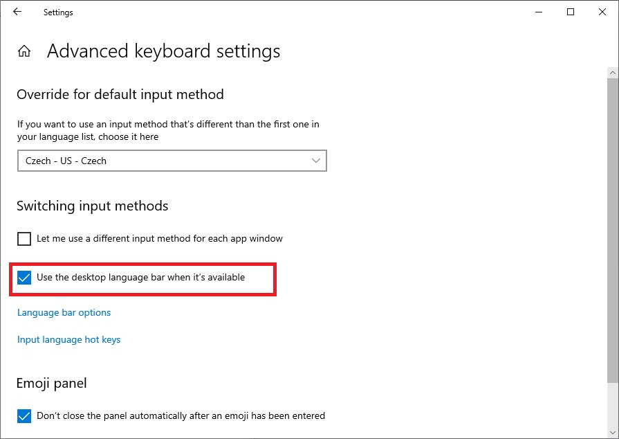

# USCS Keyboard – Windows

Uses *[Microsoft Keyboard Layout Creator (MSKLC) Version 1.4](https://www.microsoft.com/en-us/download/details.aspx?id=102134)*.

The layout is tested on *Windows 10* only. I have some limited experience with *MSKLC* layouts on *Windows 8*.

The *Windows* files are slightly out of sync with the *Linux* files.

## Description

The `.klc` file is the *MSKLC* project.

## Missing features

- × ÷

## Installation

The custom keyboard layout did not show up until this checkbox was ticked.



### Cryptic note

I have this note that I unfortunately no longer know what exactly it means, but I know that getting the layout to show up in *Windows 10* was not straightforward.

```
the custom layout needs to be different language than any other used
the desktop language bar then allows to switch to the language and thus the layout
```